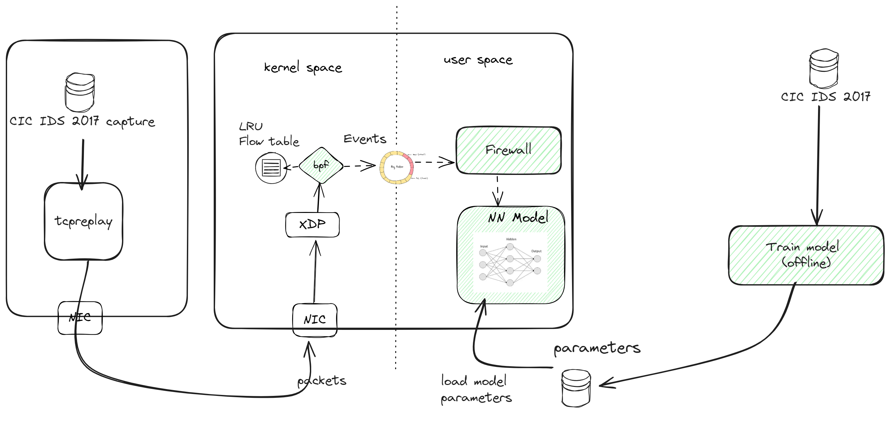

# hackathon-ids

eBPF is a new technology which allows dynamically loading pieces of code into the Linux kernel. It can greatly speed up networking since it enables the kernel to process certain packets before any other process.

The idea is to implement a ebpf program that uses ML to detect network attacks. This will be used using rust language to develop both the ebpf program (using aya https://github.com/aya-rs/aya) and ML based detection system (using Burn)

First phase will be to use CIC-IDS2017 (https://www.unb.ca/cic/datasets/ids-2017.html) dataset which contains benign and the most up-to-date common attacks to train a prediction model using candle library, and later integrate the model in an epbf program to detect attacks in a real environment.
There are similar studies like this https://arxiv.org/pdf/2102.09980, but the idea of this hackathon is to use the possibility of using rust for both the training and detection system.





## Prerequisites

1. Install bpf-linker: `cargo install bpf-linker`


## Learn model

Data from CIC IDS 2017 is stored in ml/data, to train the model run

```bash
cargo run --release --bin ml
```
The parameters learned are stored in ml/guide, and ml/guide.lock are the ones used in the ebpf program


## Build eBPF

```bash
cargo xtask build-ebpf
```

To perform a release build you can use the `--release` flag.
You may also change the target architecture with the `--target` flag.

## Build Userspace

```bash
cargo build
```

## Build eBPF and Userspace

```bash
cargo xtask build
```

## Run

Before running you have to create the virtual eth to send traffic using setup_links.sh (just once)
```bash
setup_links.sh
```

and the load the bpf program attached to this virtual eth, and the user space program:
```bash
RUST_LOG=info cargo xtask run -i ns2-veth
```
